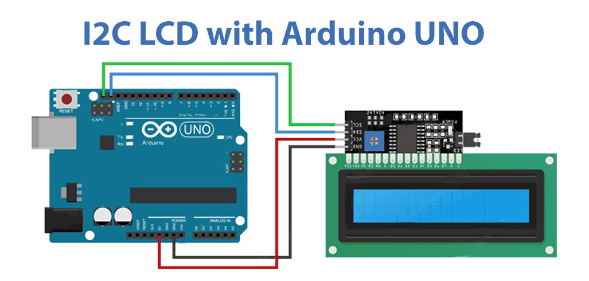

# Arduino I2C LCD Scrolling Text Display  

This project demonstrates how to use an **I2C LCD (16x2)** with an Arduino to display custom messages.  
The LCD first shows a **welcome message** and then scrolls a **channel promotion message** across the screen.  

---

## 🔧 Components Required
- Arduino Uno (or compatible board)  
- 16x2 LCD with I2C Module (PCF8574, address `0x27`)  
- Jumper Wires    

---

## ⚡ Features
- Displays a **static welcome message**  
- Scrolls a **custom text message** across the LCD  
- Uses the **LiquidCrystal_I2C library**  

---

## ⚡ Circuit Diagram
  

---

## 🎥 Demo Video
Check out the working demo on my YouTube channel:  
👉 [Ecempire7](https://www.youtube.com/@Ecempire7)  

---

## 🚀 Steps to Run
1. Connect the I2C LCD to Arduino (`SDA → A4`, `SCL → A5` on Uno).  
2. Install the **LiquidCrystal_I2C** library in Arduino IDE.  
3. Upload the code from this repository.  
4. The LCD will display the welcome message:  
